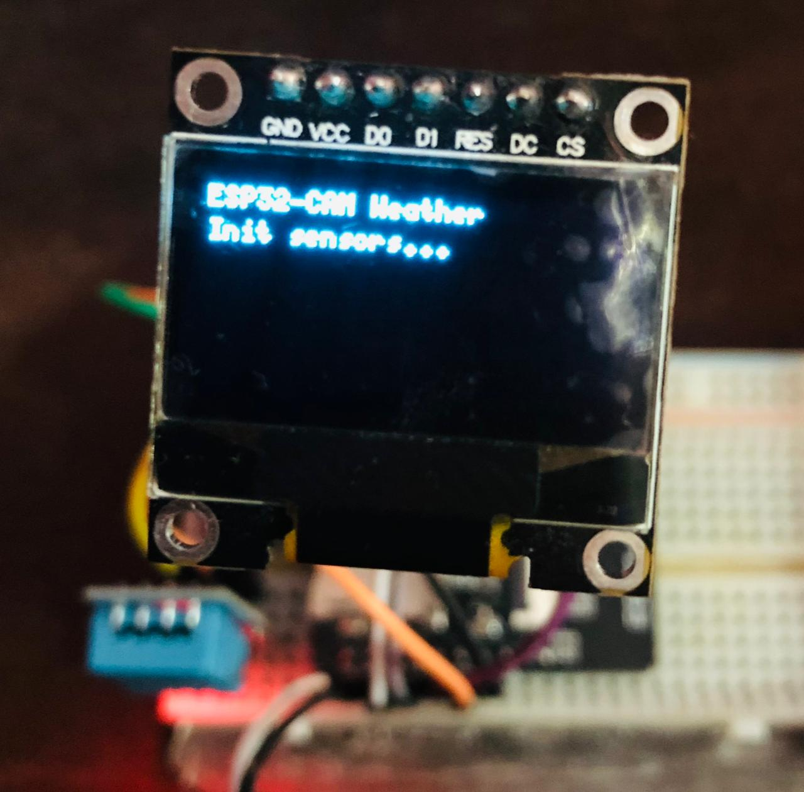
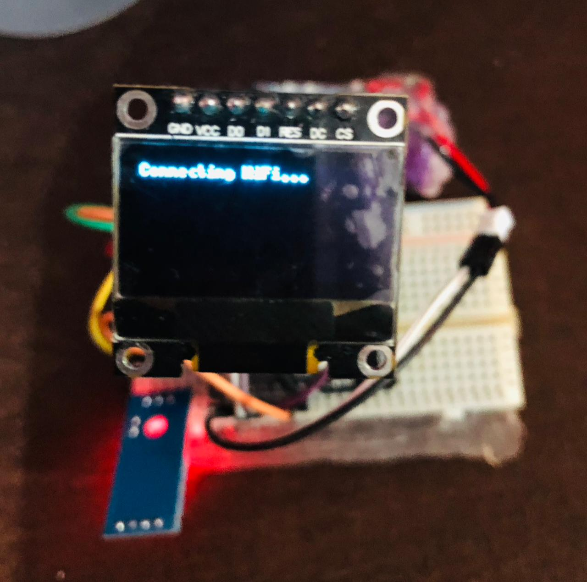
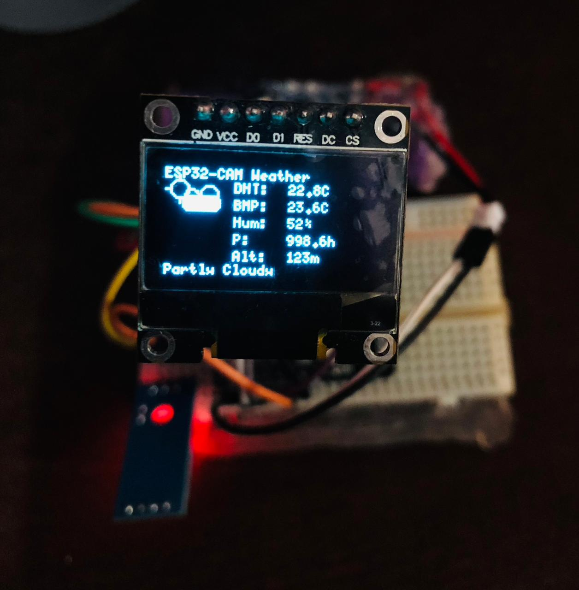

# ESP32‑CAM Animated Weather Station 🌦️

An ESP32‑CAM based **animated weather station** with both an **OLED dashboard** and a **beautiful web UI**. It reads real‑time data from a DHT11 and BMP280, renders an animated forecast on a 0.96" SSD1306 display, and serves a live, responsive dashboard at **http://esp32.local** via mDNS.[1][2][3]

## ✨ Features

- **Sensors**
  - DHT11: ambient temperature & relative humidity.[4][5]
  - BMP280: barometric pressure, temperature & calculated altitude.[6][7]
- **On‑device OLED UI**
  - Compact layout for 128×64 SSD1306.
  - Animated weather icon (sun / clouds / rain / storm).
  - Dual temperature display: **DHT vs BMP** to compare readings.
  - Humidity, pressure and altitude, plus text forecast.
- **Web UI @ http://esp32.local**
  - Modern, card‑style dashboard (HTML/CSS/JS) with smooth animations.
  - Auto‑refreshing readings via fetch/AJAX every 2 seconds.[8][9]
  - Forecast icon, trend chips, and last‑updated timestamp.
- **Local forecast engine**
  - Uses **absolute pressure bands**, **pressure trend** (10‑minute window) and **humidity** to estimate:
    - Sunny / Clear
    - Partly Cloudy
    - Cloudy
    - Rain Likely
    - Storm Risk[10][11][12]
  - Fully offline; no external weather APIs.

***
## Preview




***


## 🧱 Hardware

- ESP32‑CAM (AI‑Thinker module).[13]
- SSD1306 128×64 OLED (SPI).
- DHT11 temperature & humidity sensor.
- BMP280 temperature & barometric pressure sensor.

### Pinout

**OLED (SPI, U8g2 SW SPI):**

```text
ESP32‑CAM  →  OLED (SSD1306 SPI)
-------------------------------
GPIO1      →  SCL / CLK
GPIO2      →  SDA / MOSI
GPIO15     →  CS
GPIO13     →  DC
GPIO12     →  RST
3V3        →  VCC
GND        →  GND
```

**BMP280 (I²C):**

```text
ESP32‑CAM  →  BMP280
--------------------
GPIO0      →  SDA
GPIO16     →  SCL
3V3        →  VCC
GND        →  GND
```

**DHT11:**

```text
ESP32‑CAM  →  DHT11
-------------------
GPIO14     →  DATA
3V3        →  VCC
GND        →  GND
```

Pins are chosen to play nicely with the ESP32‑CAM’s camera, PSRAM and flash LED while still allowing Serial debugging.[14][13]

***

## 📦 Software & Libraries

Arduino IDE (or PlatformIO) with **ESP32 board support** installed.

Install these libraries via Arduino Library Manager:

- `U8g2` (by olikraus) – SSD1306 graphics.[15]
- `Adafruit BMP280 Library`.[7][6]
- `Adafruit Unified Sensor` (BMP280 dependency).[2]
- `DHT sensor library` (by Adafruit).[5]
- Core ESP32 libraries:
  - `WiFi.h`
  - `ESPmDNS.h`
  - `WebServer.h`[16][1]

Board settings (Arduino IDE):

- Board: `AI Thinker ESP32‑CAM` or `ESP32 Wrover Module` (depending on core).
- Partition: “Huge APP” or similar.
- Upload speed: 115200 or 921600 baud.

***

## 🌐 Web Server & mDNS

The ESP32‑CAM connects to your Wi‑Fi and starts:

- A **HTTP server on port 80**.
- An **mDNS responder** advertising itself as `esp32.local`.[17][1]

Update your Wi‑Fi credentials in the sketch:

```cpp
const char* ssid     = "YOUR_SSID";
const char* password = "YOUR_PASSWORD";
```

Then:

1. Flash the sketch.
2. Open Serial Monitor at 115200 to confirm Wi‑Fi connection.
3. On a device in the same network, open:

```text
http://esp32.local/
```

If mDNS is unreliable on your OS/router, use the printed IP address instead (e.g. `http://192.168.1.123`).[1]

***

## 🧠 How it works

### Sensor sampling

Every few seconds:

- DHT11: temperature `T(DHT)` and humidity `H`.[5]
- BMP280: temperature `T(BMP)`, pressure `P` (hPa) and altitude `Alt` (m) computed from pressure against sea‑level reference.[18][6]

Both **OLED** and **web API** share the latest readings.

### Forecast logic

Every 10 minutes:

- Compares new pressure vs last sample, applies a low‑pass filter to get a **pressure trend** in hPa per interval.[19][10]
- Combines:
  - absolute pressure (very high / high / low / very low),
  - sign/magnitude of trend (rising / steady / falling),
  - humidity,
- Then maps to one of the forecast states. It is tuned for “next‑hours” behaviour and can be customized for your climate.

### OLED UI

- Left: small animated weather icon (sun, clouds, rain or lightning).
- Right column:
  - DHT: `xx.x°C`
  - BMP: `xx.x°C`
  - Hum: `xx%`
  - P: `xxxx.x hPa`
  - Alt: `xxx m`
- Bottom: current forecast text.

### Web UI

- HTML/CSS/JS is served from flash as a single page.
- A JS loop calls `/api/readings` every 2 seconds and updates:
  - Big temperature display (favoring BMP280).
  - Chips for DHT/BMP temps, humidity, pressure trend.
  - Pressure + altitude labels.
  - Forecast text + emoji icon.
  - “Last update” timestamp.

This keeps traffic light while giving a “live app” feel without WebSockets.[9][8]

***

## 🚀 Getting started

1. Wire ESP32‑CAM, OLED, DHT11 and BMP280 as per the pinout.
2. Clone this repository and open the main `.ino` in Arduino IDE.
3. Install the required libraries.
4. Set your Wi‑Fi SSID/password.
5. Select the correct ESP32‑CAM board and COM port.
6. Upload and open the Serial Monitor.
7. Check:
   - OLED shows “ESP32‑CAM Weather” and live readings after a few seconds.
   - Browser shows the web dashboard at `http://esp32.local/`.

***

## 🔧 Tuning & Customization

- **Forecast sensitivity**
  - Change `PRESSURE_SAMPLE_INTERVAL` (default 10 minutes) and `TREND_ALPHA` in the code.
  - Adapt pressure thresholds in `calcForecast()` for your local climate / altitude.[12][20]
- **UI**
  - Swap U8g2 fonts (`u8g2_font_5x8_tf`) for larger/smaller fonts if needed.
  - Adjust HTML/CSS colors, fonts, and animations in the embedded page.
- **Sensors**
  - Upgrade DHT11 → DHT22 for better resolution and accuracy.
  - Swap BMP280 → BME280 to include humidity with a single sensor.[21][6]

***

## 📸 Gallery (optional)

Add your own images here, for example:

- OLED close‑up with icons and readings.
- Screenshot of the web dashboard in a browser.
- Full build photo (ESP32‑CAM + sensors + OLED on breadboard or enclosure).

***

If you extend this project (more sensors, MQTT, cloud logging, or camera integration), contributions and PRs are very welcome.

[1](https://lastminuteengineers.com/esp32-mdns-tutorial/)
[2](https://lastminuteengineers.com/bme280-esp32-weather-station/)
[3](https://iotdesignpro.com/projects/iot-based-esp32-wi-fi-weather-station-using-dht11-and-bmp-180-sensor)
[4](https://www.electronicwings.com/esp32/dht11-sensor-interfacing-with-esp32)
[5](https://randomnerdtutorials.com/esp32-dht11-dht22-temperature-humidity-sensor-arduino-ide/)
[6](https://randomnerdtutorials.com/esp32-bme280-arduino-ide-pressure-temperature-humidity/)
[7](https://www.adafruit.com/product/2651)
[8](https://randomnerdtutorials.com/esp32-web-server-gauges/)
[9](https://randomnerdtutorials.com/esp32-websocket-server-sensor/)
[10](https://forum.arduino.cc/t/weather-forecast-with-bmp085-pressure-sensor/193017)
[11](https://science.howstuffworks.com/nature/climate-weather/atmospheric/barometer.htm)
[12](https://tempest.earth/what-is-air-pressure/)
[13](https://randomnerdtutorials.com/esp32-cam-ai-thinker-pinout/)
[14](https://lastminuteengineers.com/esp32-cam-pinout-reference/)
[15](https://randomnerdtutorials.com/esp32-ssd1306-oled-display-arduino-ide/)
[16](https://lastminuteengineers.com/creating-esp32-web-server-arduino-ide/)
[17](https://docs.espressif.com/projects/esp-protocols/mdns/docs/latest/en/index.html)
[18](https://www.electronicwings.com/esp32/bmp280-barometer-sensor-interfacing-with-esp32)
[19](https://gist.github.com/Paraphraser/c5609f85cc7ee6ecd03ce179fb7f7edb)
[20](https://kestrelinstruments.com/blog/what-is-barometric-pressure-and-how-can-you-measure-it)
[21](https://www.visuino.com/weather-station-using-bmp280-dht11-temperature-humidity-and-pressure/)
[22](https://randomnerdtutorials.com/esp32-dht11-dht22-temperature-humidity-web-server-arduino-ide/)
[23](https://randomnerdtutorials.com/esp32-web-server-with-bme280-mini-weather-station/)
[24](https://lastminuteengineers.com/esp32-dht11-dht22-web-server-tutorial/)
[25](https://www.youtube.com/watch?v=S3iLSN6o7hs)
[26](https://www.youtube.com/watch?v=0fYBoL6YnJI)
[27](http://my-esp-idf.readthedocs.io/en/latest/api-reference/protocols/mdns.html)
[28](https://randomnerdtutorials.com/cloud-weather-station-esp32-esp8266/)
[29](https://docs.espressif.com/projects/esp-idf/en/stable/esp32/api-reference/protocols/mdns.html)
[30](https://github.com/cerevisis/ESP32-Weather-Station)
[31](https://www.facebook.com/groups/EmbeddedSS/posts/3980062098678410/)
[32](https://randomnerdtutorials.com/esp32-cam-video-streaming-web-server-camera-home-assistant/)
[33](https://techtutorialsx.com/2020/04/18/esp32-advertise-service-with-mdns/)
[34](https://robocraze.com/blogs/post/building-a-weather-station-using-esp32-webserver)
[35](https://github.com/espressif/arduino-esp32/issues/10613)
[36](https://www.elecrow.com/blog/how-to-make-an-esp32-weather-e-paper.html)
